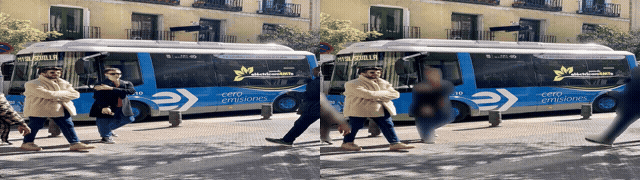
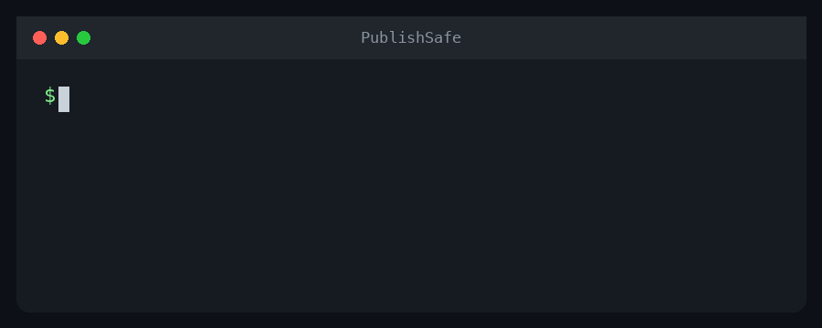
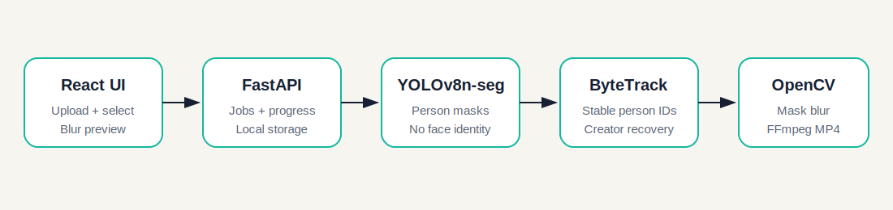

# PublishSafe

**Privacy-preserving video publishing for creators.**

PublishSafe detects and tracks people, keeps the selected creator visible, and
blurs everyone else along their body masks. Video stays on the machine running
PublishSafe.



Left: original public sample. Right: one person preserved while other people
are protected.

## Quick start with Docker

Requirements: [Docker Desktop](https://www.docker.com/products/docker-desktop/)



```bash
git clone https://github.com/96528025/publishsafe.git
cd publishsafe
./scripts/start.sh
```

Open `http://localhost:5173`.

The first start builds the containers and downloads the YOLO segmentation
weights, so it takes longer than later starts.

```bash
# Follow startup and processing logs
docker compose logs -f

# Stop PublishSafe
./scripts/stop.sh
```

## What it does

1. Upload an MP4, MOV, AVI, MKV, or WebM video.
2. YOLOv8n-seg detects person masks and ByteTrack assigns stable IDs.
3. Select yourself from an annotated preview.
4. Adjust the default anonymizing blur on a 10-100 strength slider, or choose
   the experimental avatar mode.
   The selected creator and blur strength are shown immediately on one frame.
5. Preview the first 10 seconds at a faster 15 FPS / 720p proxy quality.
6. Process and download the protected MP4.

The default privacy rule is **protect everyone except the selected creator**.
Uploads and outputs stay in local `uploads/` and `outputs/` directories.

## Architecture



## Project structure

```text
publishsafe/
├── assets/avatars/       # Generated transparent mascot PNGs
├── backend/
│   ├── app/
│   │   ├── main.py       # FastAPI routes and upload analysis
│   │   ├── processor.py  # Background video processing jobs
│   │   ├── tracker.py    # Small fallback tracking utilities
│   │   └── vision.py     # YOLO segmentation and privacy rendering
│   └── requirements.txt
├── frontend/             # Vite + React UI
├── outputs/
└── uploads/
```

## Run from source

Requirements:

- Python 3.10+
- Node.js 18+
- Optional: `ffmpeg` to preserve source audio in the exported MP4

From the project root:

```bash
python3 -m venv .venv
source .venv/bin/activate
pip install -r backend/requirements.txt
cd frontend && npm install && cd ..
```

The first backend start downloads the open-source YOLOv8 nano segmentation
weights (`yolov8n-seg.pt`). No model is trained by this project.

Terminal 1:

```bash
source .venv/bin/activate
uvicorn backend.app.main:app --reload --port 8000
```

Terminal 2:

```bash
cd frontend
npm run dev
```

Open `http://localhost:5173`. API documentation is available at
`http://localhost:8000/docs`.

## Sample video

Generate a small public sample video based on the Ultralytics bus image:

```bash
./scripts/download_sample.sh
```

Upload `samples/publishsafe-sample.mp4` through the UI.

The download is optional and requires `curl` and `ffmpeg`.

## Fast testing with your own video

Use a short, low-resolution clip while tuning blur or tracking:

```bash
./scripts/make_test_clip.sh /path/to/video.mp4
```

To test a specific section, pass the start time and duration in seconds:

```bash
./scripts/make_test_clip.sh /path/to/video.mp4 10 5
```

The script creates a 960x540, 15 FPS clip in `test-clips/`. Upload that clip
through the normal UI. Five seconds is about 75 frames and processes much
faster than a full 4K video.

## Troubleshooting

### Docker starts, but the page is unavailable

```bash
docker compose ps
docker compose logs -f
```

Wait until the backend health check passes. The first model download may take
several minutes.

### Port 5173 is already in use

Stop another local Vite/PublishSafe process, or change the frontend mapping in
`docker-compose.yml`:

```yaml
ports:
  - "8080:80"
```

Then open `http://localhost:8080`.

### Processing remains at 99%

Frame processing has finished and FFmpeg is encoding H.264 and restoring
audio. Large 4K videos can spend noticeable time in this final stage.

### Docker runs out of memory

Increase Docker Desktop's memory allocation. PyTorch and Ultralytics are large
dependencies. Testing with a 720p or 1080p clip also reduces memory pressure.

### Person IDs switch during a crossing

PublishSafe uses ByteTrack plus clothing appearance recovery, but long
occlusions and similar outfits can still cause errors. Try a clearer preview
frame or open an issue with a reproducible, non-sensitive sample.

### Apple Silicon GPU is not used in Docker

The Docker setup currently uses CPU inference for portability. Running from
source on macOS is the path for future MPS acceleration work.

## Performance and quality

The current full-video pipeline is the **quality-first baseline**:

- It processes every source frame with YOLO and ByteTrack.
- It preserves the source resolution and frame rate in the rendered video.
- It uses the full tracking history instead of intentionally skipping frames.
- It encodes a browser-compatible H.264 MP4 and restores the source audio.

This makes the current version slow on 4K or high-FPS footage, but it avoids
deliberately reducing temporal coverage or output resolution. It is the
highest-quality mode currently implemented in PublishSafe, not a guarantee of
perfect results. Detection can still fail for small people, motion blur, long
occlusions, or people with similar clothing.

Approximate work scales with:

```text
video duration x source FPS x per-frame detection/rendering cost
```

For example, 10 seconds at 30 FPS contains about 300 frames, while one minute
at 60 FPS contains about 3,600 frames.

### Future optimization options

1. **Generate a proxy video after upload**

   Convert 4K footage to a 720p or 1080p working copy for detection, tracking,
   and previews. This should provide one of the largest speed improvements.
   Bounding boxes can later be scaled back to the original video. Tradeoff:
   very small or distant people may be harder to detect.

2. **Use Apple GPU acceleration**

   Run PyTorch/YOLO on the Apple Silicon `MPS` device when available instead of
   CPU-only inference. This may substantially improve model speed. It requires
   compatibility and memory testing on the target Mac.

3. **Detect every second or third frame**

   Run YOLO less frequently and use ByteTrack, interpolation, or optical flow
   for frames between detections. This can remove 50-67% of detector calls.
   Tradeoff: fast movement, brief appearances, and crossings may be less
   accurate.

4. **Reduce YOLO input size**

   Lower `imgsz` from 640 to 512 or 416 for preview/fast modes. Tradeoff:
   reduced accuracy for small or distant people.

5. **Add output quality presets**

   Offer modes such as:

   ```text
   Fast:      720p / 15 FPS
   Balanced:  1080p / 30 FPS
   Original:  source resolution / source FPS
   ```

   This lets users choose processing speed versus output fidelity.

6. **Use Apple VideoToolbox encoding**

   Replace CPU `libx264` encoding with `h264_videotoolbox` when available.
   This primarily reduces the final 99% encoding/audio-merging wait. Tradeoff:
   hardware encoding can produce different quality or file sizes at equivalent
   settings.

7. **Cache detection and tracking results**

   Persist per-frame boxes and track IDs. A full render can then reuse the
   first 10 seconds already analyzed for the effect preview, and users can
   change avatar/blur styles without rerunning YOLO. This improves repeated
   renders without sacrificing detection quality, at the cost of additional
   cache storage and implementation complexity.

8. **Evaluate newer lightweight detectors**

   Benchmark YOLO11n or another small person detector against YOLOv8n using the
   same videos. A newer model is not automatically faster or more accurate, so
   it should only replace the baseline after measured comparison.

### Recommended optimization order

The most practical next performance iteration is:

```text
1080p proxy detection
-> MPS acceleration
-> cached tracking results
-> VideoToolbox encoding
-> optional frame skipping in Fast mode
```

Keep the current every-frame, original-resolution workflow as an `Original`
quality option so speed improvements do not remove the quality-first baseline.

## Contributing

Contributions are welcome. See [CONTRIBUTING.md](CONTRIBUTING.md). Do not attach
private or identifying videos to issues or pull requests.

## License

PublishSafe is licensed under the
[GNU Affero General Public License v3.0](LICENSE), consistent with its
Ultralytics dependency.

## API

- `POST /api/upload`: validate, store, analyze, and create a preview
- `POST /api/frame-preview`: render a fast single-frame blur preview
- `POST /api/process`: start a protected-video job
- `GET /api/jobs/{job_id}`: poll status and frame progress
- `GET /api/health`: detector/tracker health summary

## MVP notes

- Blur mode uses instance-segmentation masks, with mask dilation and feathered
  edges so the background remains clear. It falls back to a bounding box if a
  mask is unavailable on a frame.
- Tracking uses ByteTrack with a longer occlusion buffer. A clothing-appearance
  fallback recovers the selected creator when IDs switch during crossings.
- Processing is serialized around the YOLO model for demo reliability.
- OpenCV writes video frames. When `ffmpeg` is installed, source audio is
  automatically merged into the final file.
- Tracking can still struggle after a long full-body occlusion. A polished
  version should use learned ReID embeddings and persist analyzed tracks before
  rendering.

## Privacy

PublishSafe performs person detection, not face identification. It does not
attempt to infer names or identities. This MVP stores media locally and does
not upload it to an external service.
