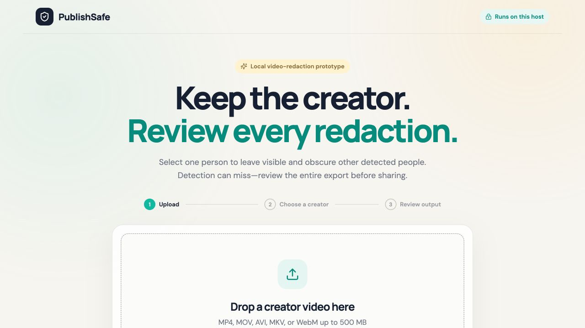

# PublishSafe

[](https://github.com/96528025/publishsafe/actions/workflows/ci.yml)

[English](README.md) | [简体中文](README.zh-CN.md)

**A local-first prototype for reviewing and redacting people in creator video.**

PublishSafe combines a React workflow with FastAPI, YOLOv8n-seg, ByteTrack,
OpenCV, and FFmpeg. It proposes person tracks, lets an operator choose one
creator to leave visible, and attempts to obscure every other detected person
before MP4 export. Media processing stays on the host running the application;
the application does not send video to a hosted inference API.

Blur is weak de-identification, not anonymity. Detection, segmentation,
tracking, and rendering can fail, while voice, text, reflections, clothing,
gait, and context can still identify someone. Treat every result as a review
candidate, not as safe-to-publish output. Read the
[threat model and human-review guide](docs/threat-model.md).



This screenshot is generated from the current UI without uploaded media. It
documents product framing and review warnings, not model accuracy or privacy.

## 30-second review

| Question | Answer |
| --- | --- |
| What is it? | A one-visible-creator video-redaction workflow for trusted localhost use |
| Core pipeline | Upload → YOLO person candidates → ByteTrack IDs → creator selection → mask blur/avatar overlay → OpenCV/FFmpeg export |
| Backend scope | Capability-scoped media APIs, private storage/retention, in-process job progress, video I/O, model/tracker integration, and fail-closed decision logic |
| Evidence | Model-free Python tests, React production build, Compose validation, deterministic evaluation-metric tests, and a documented manual sample recipe |
| Current maturity | Portfolio MVP; not a hosted service, certified anonymizer, identity system, or unattended publishing tool |
| Missing evidence | No checked-in real-video benchmark, real-YOLO CI, privacy certification, public deployment, or proof that identity is removed |


The diagram describes application data flow. It is not a claim of stable
identity tracking or a formal security boundary.

## What is implemented

1. Upload an MP4, MOV, AVI, MKV, or WebM video.
2. Generate a preview from YOLO person detections and ByteTrack IDs.
3. Select the creator who may remain visible.
4. Preview adjustable blur strength, or configure an experimental avatar for the render.
5. Render a short proxy preview or every decoded source frame.
6. Review and download the processed MP4.

The default policy is to **attempt to redact each detected person except the
selected creator**:

- missing, invalid, empty, or obviously degraded masks fall back to a padded
  bounding-box blur;
- preview candidates and boxes come from a private server-owned manifest; the
  frame-preview API rejects client-supplied candidate geometry;
- the full render compares candidates with the appearance reference derived
  from the upload-time selected preview, rather than trusting a recycled
  tracker integer;
- the selected track is exempted only when conservative appearance and
  detection checks are strong and unambiguous;
- ambiguous creator tracking blurs every detected person on that frame instead
  of guessing;
- source audio is removed by default; preserving it requires an explicit
  choice and fails visibly if FFmpeg cannot honor that choice.

These are uncalibrated safety heuristics, not accuracy guarantees. A detector
miss, plausible-but-incomplete mask, identity error, or export defect can still
leave sensitive content visible.

### Preview and full-render behavior

| Mode | Purpose | Implementation |
| --- | --- | --- |
| Single-frame preview | Inspect selection and blur strength | One derived JPEG |
| Short preview | Inspect motion before a full run | Opening segment at capped proxy dimensions/frame rate |
| Full process | Produce a review candidate | Source dimensions and frame rate; each decoded frame is processed |

A short preview is not acceptance testing. Review the complete exported file.

## Private-media boundary

- Raw uploads have **no HTTP route**.
- Video-specific preview, process, job-status, and delete operations require a
  bearer session capability scoped to one upload.
- Derived previews and outputs use five-minute HMAC-signed capability URLs
  bound to an artifact and, for output, a job.
- Media responses use private/no-store, no-referrer, and nosniff headers.
- Private directories use owner-only permissions (0700); files use 0600.
- Sessions expire after 24 hours by default. “Change video” calls the delete
  endpoint immediately, active frame/FFmpeg work receives cancellation, and a
  startup/periodic janitor removes expired media.
- The UI can refresh expired preview/output capabilities through a
  session-authorized route. Download responses use a fixed non-secret filename.
- Docker Compose publishes the web entry point only on
  `127.0.0.1:5173`.

These controls reduce accidental local exposure. They are possession-based
capabilities, not user accounts, multi-tenant authorization, TLS, sandboxing,
or secure erase. The default signing secret is process-local, so a restart
revokes existing links; the in-memory job registry also loses status on
restart. Active streams, open file handles, browser caches, backups, snapshots,
and downstream copies may outlive ordinary deletion.

Do not expose this MVP directly to the public internet.

## Evidence and evaluation

### Checked automatically

CI runs three jobs:

| Job | Scope |
| --- | --- |
| Python tests | API validation and dispatch, capability scope/expiry, raw-route denial, server-owned selection manifests and upload-time anchors, active-job cancellation, deletion/TTL cleanup, preview refresh, safe download names, traversal/symlink rejection, permissions, mask fallback, creator-exemption decisions, audio policy, processing failure cleanup, and metric math |
| Frontend build | Clean install, high-severity dependency audit, and React production build |
| Compose config | Docker Compose configuration parsing |

The Python suite is deliberately model-free. It installs
`backend/requirements-test.txt`, does not load Ultralytics or PyTorch, does
not download model weights, and blocks outbound network access.

### Not checked automatically

CI does not run real YOLO inference, ByteTrack on real crossings, video
decode/encode, FFmpeg, rendered-pixel inspection, or performance measurement.
It does not establish detector recall, mask coverage, identity removal, or
audio/text/reflection safety.

No real annotated privacy dataset or real-video benchmark is checked in. The
synthetic geometry under `evaluation/fixtures/` validates metric calculations
only; its scores must never be reported as model or product performance.

### Reproducible privacy-evaluation harness

The offline [evaluation harness](evaluation/README.md) consumes dense
frame-by-frame ground truth and redaction-candidate predictions. It reports:

- person recall for instances explicitly marked `should_redact: true`;
- the longest consecutive missed-redaction run for the same ground-truth
  person/track;
- breakdowns based only on explicit `occlusion`, `low_light`, `crowd`,
  and `profile` labels, plus dataset-specific labels.

Matching uses a deterministic maximum-cardinality one-to-one assignment over
box pairs that satisfy the selected IoU threshold.

```bash
python -m evaluation.evaluate \
  --ground-truth path/to/ground_truth.json \
  --predictions path/to/predictions.json \
  --iou-threshold 0.5 \
  --output path/to/report.json
```

The optional real-YOLO runner measures detector-box coverage only. It does not
exercise creator exclusion, tracking recovery, masks, rendering, audio, or
export. The harness documents dataset consent, licensing, annotation, and
reporting requirements before any real result is claimed.

## Quick start with Docker

Requirement: [Docker Desktop](https://www.docker.com/products/docker-desktop/)

```bash
git clone https://github.com/96528025/publishsafe.git
cd publishsafe
./scripts/start.sh
```

Open `http://localhost:5173`. The first start builds containers and may
download YOLO weights, so it takes longer than later starts.

```bash
docker compose logs -f
./scripts/stop.sh
```

## Run from source

Requirements:

- Python 3.10+
- Node.js 18+
- Optional: FFmpeg for H.264 output and explicit source-audio preservation

```bash
python3 -m venv .venv
source .venv/bin/activate
pip install -r backend/requirements.txt
cd frontend && npm install && cd ..
```

The first backend start may download pretrained `yolov8n-seg.pt` weights.
PublishSafe integrates that model; it does not train one.

Terminal 1:

```bash
source .venv/bin/activate
uvicorn backend.app.main:app --reload --port 8000
```

Terminal 2:

```bash
cd frontend
npm run dev
```

Open `http://localhost:5173`; local API documentation is at
`http://localhost:8000/docs`.

## Test

```bash
python3 -m venv .venv
source .venv/bin/activate
pip install -r backend/requirements-test.txt
pytest
```

```bash
cd frontend
npm ci
npm run build
```

Validate Compose:

```bash
docker compose config --quiet
```

For a local manual recipe, the helper can generate motion from an external
Ultralytics sample image, then you can upload it through the UI:

```bash
./scripts/download_sample.sh
```

The helper requires `curl` and FFmpeg. It downloads a mutable third-party asset
whose license and immutable hash are not asserted by this repository, so it is
excluded from release evidence and must not be redistributed without an
independent provenance/license check. Manual observation is not a benchmark.

## API surface

- `POST /api/upload`: create a retained private session, analyze the clip,
  and return a video-scoped bearer capability
- `POST /api/frame-preview`: create a derived frame preview (session
  capability required)
- `GET /api/videos/{video_id}/preview-capability`: refresh one derived preview
  URL (session capability required)
- `POST /api/process`: start a render job (session capability required)
- `GET /api/jobs/{job_id}`: poll status and refresh a derived-output URL
  (session capability required)
- `GET /api/media/{capability}`: retrieve one short-lived preview or output;
  output requests may opt into a fixed-name attachment response
- `DELETE /api/videos/{video_id}`: delete the scoped source and derived media
- `GET /api/health`: report model/tracker/runtime configuration

Raw `/uploads` and `/outputs` paths are not mounted.

## Project structure

```text
publishsafe/
├── backend/
│   ├── app/
│   │   ├── capabilities.py  # HMAC session/media capabilities
│   │   ├── main.py          # FastAPI routes and upload analysis
│   │   ├── privacy.py       # Conservative creator-exemption decisions
│   │   ├── processor.py     # In-process video jobs and export
│   │   ├── storage.py       # Private paths, deletion, and TTL cleanup
│   │   └── vision.py        # Model integration and rendering helpers
│   ├── tests/
│   └── requirements*.txt
├── evaluation/              # Offline schemas, metrics, tests, optional runner
├── frontend/                # Vite + React UI
├── docs/                    # Architecture and threat model
├── assets/avatars/
├── uploads/                 # Git-ignored private working sessions
└── outputs/                 # Git-ignored private per-job renders
```

## Security and responsible reporting

Read [SECURITY.md](SECURITY.md) before reporting a vulnerability. Never attach
private, identifying, confidential, or unlicensed media, access capabilities,
paths, or unredacted logs to an issue or pull request. Use synthetic geometry
or properly licensed public sample material.

## Maintainer owner mode

The repository contains a native accelerated profile for the maintainer's
preconfigured Apple M2 Mac:

```bash
./scripts/start_owner.sh
```

It uses PyTorch MPS and VideoToolbox and requires a Git-ignored local machine
fingerprint. Cloning the repository does not enable it on another computer.
Everyone else should use `./scripts/start.sh`.

```bash
./scripts/stop_owner.sh
```

## Roadmap (not implemented)

Potential work includes a durable job control plane and independent worker,
real annotated evaluation data, rendered-mask/pixel coverage, manual
redaction, identity-aware multi-user access, stronger deletion verification,
and audio/text/plate/reflection tools. These are ideas, not shipped features.

## Contributing and license

Contributions are welcome; see [CONTRIBUTING.md](CONTRIBUTING.md). PublishSafe
is licensed under the [GNU Affero General Public License v3.0](LICENSE),
consistent with its current Ultralytics dependency.
