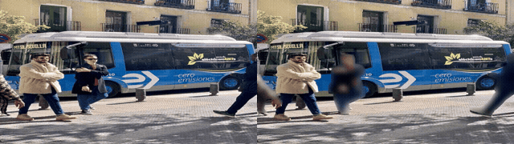
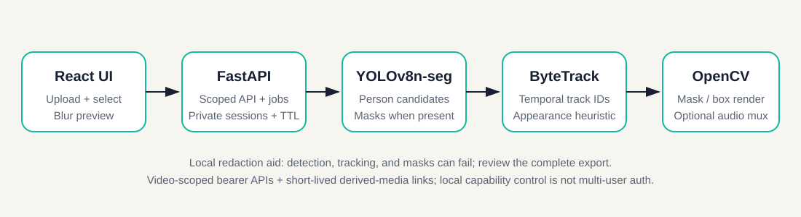

# PublishSafe

[](https://github.com/96528025/publishsafe/actions/workflows/ci.yml)

[English](README.md) | [简体中文](README.zh-CN.md)

**本地优先的视频人物遮挡与人工复核原型。**

PublishSafe 由 React、FastAPI、YOLOv8n-seg、ByteTrack、OpenCV 和 FFmpeg
组成。它提出人物轨迹，让操作者选择一名可保持可见的创作者，并在导出 MP4
前尝试遮挡其他已检测人物。媒体始终在运行应用的主机上处理，不会发送到托管
推理 API。

模糊只是较弱的去识别化手段，并不等于匿名。检测、分割、追踪和渲染都可能
失败；声音、文字、反射、衣着、步态和场景仍可能暴露身份。所有结果都只是
待复核版本，而不是可直接发布的安全成片。详见
[威胁模型与人工复核指南](docs/threat-model.md)。



该动图只演示仓库样例上的流程，不是准确率 benchmark、匿名证明或当前 UI
验收结果。

## 30 秒了解项目

| 问题 | 当前答案 |
| --- | --- |
| 做什么 | 在可信本机上处理“一名创作者保持可见”的视频人物遮挡 |
| 核心链路 | 上传 → YOLO 人物候选 → ByteTrack ID → 选择创作者 → mask 模糊/头像覆盖 → OpenCV/FFmpeg 导出 |
| 后端重点 | capability 限权媒体 API、私有存储与 TTL、进程内任务进度、视频 I/O、模型/追踪集成和 fail-closed 决策 |
| 已有证据 | model-free Python 测试、React production build、Compose 校验、确定性评估指标测试和人工样例流程 |
| 当前成熟度 | 作品集 MVP；不是托管服务、认证匿名化工具、多用户系统或无人值守发布工具 |
| 尚无证据 | 没有仓库内真实视频 benchmark、真实 YOLO CI、隐私认证、公网部署或身份已被移除的证明 |



架构图描述数据流，不代表稳定身份追踪或经过形式化验证的安全边界。

## 已实现流程

1. 上传 MP4、MOV、AVI、MKV 或 WebM。
2. 根据 YOLO 人物检测和 ByteTrack ID 生成预览。
3. 选择一名可能保持可见的创作者。
4. 预览可调节模糊，或使用实验性的头像覆盖。
5. 生成短代理预览，或处理每一个解码到的源视频帧。
6. 人工复核并下载处理后的 MP4。

默认策略是**尝试遮挡每一个已检测人物，仅豁免选中的创作者**：

- mask 缺失、非法、全零或明显退化时，回退到带边距方框模糊；
- 只有检测置信度与外观证据足够强且没有歧义，当前轨迹才会被豁免；
- 创作者追踪不确定时，该帧所有已检测人物都会被模糊，而不是猜测身份；
- 默认移除源音频；保留音频必须显式选择，FFmpeg 无法满足时任务会明确失败。

这些是尚未用真实隐私数据校准的保守启发式，不是准确率保证。漏检、看似正常
但不完整的 mask、ID 错误和导出缺陷仍可能暴露内容。

## 私有媒体边界

- 原始上传文件没有任何 HTTP 路由。
- 单帧预览、处理、任务查询和删除接口都要求仅绑定本次视频的 bearer session
  capability。
- 派生预览和输出使用 5 分钟 HMAC 签名 URL；输出 URL 还绑定具体 job。
- 媒体响应带有 private/no-store、no-referrer 和 nosniff。
- 私有目录权限为 0700，文件为 0600。
- 会话默认 24 小时过期；“更换视频”会立即调用删除接口，启动与周期清理任务
  会移除过期媒体。
- Docker Compose 默认只发布到 `127.0.0.1:5173`。

这些控制降低本机误暴露风险，但 capability 只是“持有者可访问”的令牌，不是
用户账号、多租户权限、TLS、进程沙箱或安全擦除。默认签名密钥随进程生成，
重启会撤销旧链接；内存任务状态也会在重启后丢失。已经开始的传输、打开的文件
句柄、浏览器缓存、备份、快照和下游副本可能继续存在。

不要把当前 MVP 直接暴露到公网。

## 证据与评估

CI 包含三个任务：

| 任务 | 覆盖范围 |
| --- | --- |
| Python 测试 | 请求校验、capability 范围/过期、禁止原片路由、删除/TTL、路径穿越和软链接拒绝、权限、mask 回退、创作者豁免、音频策略、失败清理与指标数学 |
| 前端构建 | 全新安装后的 React production build |
| Compose | Docker Compose 配置解析 |

Python 测试采用 model-free 设计：不会加载 Ultralytics/PyTorch、下载模型或
访问网络。CI 也不会用真实视频运行 YOLO、ByteTrack、OpenCV 编解码或 FFmpeg，
因此不能证明检测 recall、mask 覆盖、身份移除或音频/文字/反射安全。

仓库没有真实标注隐私数据集，也不发布真实视频 benchmark。
`evaluation/fixtures/` 中的合成几何数据只验证指标计算，不能作为模型或产品
性能数字。

离线[评估工具](evaluation/README.md)读取逐帧 GT 与候选遮挡 JSON，输出：

- `should_redact: true` 人物实例的 recall；
- 同一 GT 人物/轨迹最长连续漏遮挡帧数；
- 仅来自显式 `occlusion`、`low_light`、`crowd`、`profile` 标签的
  场景分解。

匹配采用确定性的最大基数一对一分配，避免一个预测覆盖两人，也避免 IoU 贪心
少算可匹配人物。

```bash
python -m evaluation.evaluate \
  --ground-truth path/to/ground_truth.json \
  --predictions path/to/predictions.json \
  --iou-threshold 0.5 \
  --output path/to/report.json
```

可选 YOLO runner 只测检测框覆盖，不包含创作者豁免、追踪恢复、mask、最终
渲染、音频或导出。报告真实数字之前，必须记录数据许可/参与者同意、标注规则、
模型版本、配置和 commit。

## Docker 启动

先安装并打开 [Docker Desktop](https://www.docker.com/products/docker-desktop/)。

```bash
git clone https://github.com/96528025/publishsafe.git
cd publishsafe
./scripts/start.sh
```

打开 `http://localhost:5173`。第一次启动会构建容器，并可能下载 YOLO 权重。

```bash
docker compose logs -f
./scripts/stop.sh
```

## 从源码启动

需要 Python 3.10+、Node.js 18+；FFmpeg 用于 H.264 输出和显式保留源音频。

```bash
python3 -m venv .venv
source .venv/bin/activate
pip install -r backend/requirements.txt
cd frontend && npm install && cd ..
```

首次启动后端时可能下载预训练 `yolov8n-seg.pt`。本项目集成该模型，不训练模型。

```bash
# 终端 1
source .venv/bin/activate
uvicorn backend.app.main:app --reload --port 8000

# 终端 2
cd frontend
npm run dev
```

打开 `http://localhost:5173`；本地 API 文档位于
`http://localhost:8000/docs`。

## 测试

```bash
python3 -m venv .venv
source .venv/bin/activate
pip install -r backend/requirements-test.txt
pytest

cd frontend
npm ci
npm run build
```

```bash
docker compose config --quiet
```

人工样例流程：

```bash
./scripts/download_sample.sh
```

样例脚本需要 `curl` 和 FFmpeg。人工观看不是 benchmark。

## API

- `POST /api/upload`：建立私有会话、分析视频并返回 session capability
- `POST /api/frame-preview`：生成派生单帧预览，需要 session capability
- `POST /api/process`：启动处理任务，需要 session capability
- `GET /api/jobs/{job_id}`：查询状态并刷新输出链接，需要 session capability
- `GET /api/media/{capability}`：读取一个短时预览或输出
- `DELETE /api/videos/{video_id}`：删除该会话的源文件与全部派生媒体
- `GET /api/health`：返回模型、追踪和运行配置

没有 `/uploads` 或 `/outputs` 静态挂载。

## 人工复核与安全报告

发布前必须完整观看导出文件，重点检查人物进入/离开、交叉、遮挡、低光、人群、
侧身、画面边缘、反射、头发/手脚和逐帧闪漏，并确认豁免从未切换到他人。还要
单独检查音频策略、声音、文字、车牌、徽章、屏幕、地点和元数据。

请先阅读 [SECURITY.md](SECURITY.md)。不要在 Issue、PR、Discussion 或安全
报告中上传私人、可识别、机密或未授权的媒体、capability、路径或未脱敏日志。

## 维护者加速模式

仓库保留维护者预配置 Apple M2 Mac 的原生 MPS/VideoToolbox 入口：

```bash
./scripts/start_owner.sh
```

它依赖不会提交到 Git 的本机指纹；普通用户应使用 `./scripts/start.sh`。

```bash
./scripts/stop_owner.sh
```

## 路线图（尚未实现）

候选方向包括持久任务控制面与独立 worker、真实标注评估数据、最终渲染像素/
mask 覆盖、手工遮挡、多用户身份与权限、更强删除验证，以及音频/文字/车牌/
反射处理。这些是计划，不是已实现能力。

## 开源协议

PublishSafe 使用 [GNU Affero General Public License v3.0](LICENSE)，与当前
Ultralytics 依赖保持一致。贡献说明见 [CONTRIBUTING.md](CONTRIBUTING.md)。
