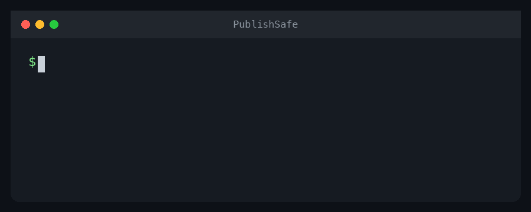

# PublishSafe

[English](README.md) | [简体中文](README.zh-CN.md)

**面向视频创作者的隐私保护发布工具。**

PublishSafe 会检测并追踪视频中的人物。你可以选择“哪一个人是我”，
系统会保留创作者，并沿着其他人物的身体轮廓添加动态模糊，避免在发布视频时
暴露路人、朋友或其他参与者的身份。

视频默认只在运行 PublishSafe 的电脑上处理，不会上传到外部服务。


左侧为公开示例原图，右侧保留一名创作者并保护其他人物。

## Docker 一键启动

请先安装并打开
[Docker Desktop](https://www.docker.com/products/docker-desktop/)。



在终端运行：

```bash
git clone https://github.com/96528025/publishsafe.git
cd publishsafe
./scripts/start.sh
```

然后在浏览器打开：

```text
http://localhost:5173
```

第一次启动需要构建容器并下载 YOLO 模型，因此会比以后启动更慢。

```bash
# 查看启动和视频处理日志
docker compose logs -f

# 停止 PublishSafe
./scripts/stop.sh
```

## 维护者 Owner 加速模式

项目同时保留了一个只为维护者这台 Apple M2 Mac 配置的原生加速入口：

```bash
./scripts/start_owner.sh
```

该模式使用 PyTorch MPS 调用 Apple GPU，并使用 VideoToolbox 进行 H.264
硬件编码。本机身份记录在一个不会上传 GitHub 的私有指纹文件中，因此其他人
Clone 项目后无法误用这个模式。

普通用户仍然统一使用 `./scripts/start.sh`。两个模式共用同一套前端、检测、
追踪、模糊和导出代码，区别仅在于运行设备和最终编码器。

在启动终端按 `Ctrl+C` 可以停止 Owner 模式，也可以运行：

```bash
./scripts/stop_owner.sh
```

## 使用流程

1. 上传 MP4、MOV、AVI、MKV 或 WebM 视频。
2. YOLOv8n-seg 检测人物轮廓，ByteTrack 为人物分配追踪 ID。
3. 在预览图中选择“哪一个人是我”。
4. 使用 10–100 滑块调整模糊强度，或尝试实验性的头像模式。
5. 先查看单帧效果，也可以生成前 10 秒测试视频。
6. 确认效果后，处理并下载完整 MP4。

默认隐私规则是：**保留选中的创作者，保护其他所有人物。**

上传文件和处理结果保存在仅限当前服务访问的本地目录。原片没有 HTTP 访问路由；
预览和成片只通过 5 分钟有效的签名链接提供。“更换视频”会立即删除本次会话的
全部媒体，后台清理任务默认会在 24 小时后自动删除过期文件。

## 预览与完整视频画质

为了让用户更快确认人物选择和模糊效果，PublishSafe 会降低测试预览的处理量：

| 模式 | 用途 | 画质 |
| --- | --- | --- |
| 单帧预览 | 确认创作者和模糊强度 | 一张 JPEG 图片 |
| 前 10 秒测试 | 快速检查动态追踪效果 | 最大宽度 1280px，约 15 FPS |
| Full Process | 生成最终发布视频 | 原始分辨率、原始 FPS、逐帧处理 |

**预览画质不会影响 Full Process 的最终导出。**

例如，上传 4K 30 FPS 视频后，前 10 秒测试会使用较快的代理画质，
但最终完整视频仍然按照 4K 30 FPS 处理。

## 速度说明

当前完整视频处理采用“画质优先”方案：

- 每一帧都运行人物检测和追踪。
- 保留原视频的分辨率和帧率。
- 使用人物分割轮廓进行模糊，而不是简单覆盖整个长方形。
- 安装 FFmpeg 后会恢复原视频音频并导出 H.264 MP4。

因此，4K、高 FPS 或时间较长的视频会比较慢。大致计算量为：

```text
视频时长 × 原始 FPS × 每帧检测和渲染成本
```

例如，10 秒 30 FPS 视频约有 300 帧；一分钟 60 FPS 视频约有 3600 帧。

## 快速测试自己的视频

调试模糊程度或追踪效果时，可以先生成一个低分辨率短片：

```bash
./scripts/make_test_clip.sh /path/to/video.mp4
```

也可以指定开始时间和持续秒数：

```bash
./scripts/make_test_clip.sh /path/to/video.mp4 10 5
```

脚本会在 `test-clips/` 中生成 960×540、15 FPS 的测试视频。

## 不使用 Docker

需要提前安装：

- Python 3.10+
- Node.js 18+
- FFmpeg（推荐，用于保留音频）

安装依赖：

```bash
git clone https://github.com/96528025/publishsafe.git
cd publishsafe
python3 -m venv .venv
source .venv/bin/activate
pip install -r backend/requirements.txt
cd frontend && npm install && cd ..
```

启动后端：

```bash
source .venv/bin/activate
uvicorn backend.app.main:app --reload --port 8000
```

在另一个终端启动前端：

```bash
cd frontend
npm run dev
```

然后打开 `http://localhost:5173`。

## 测试

后端测试刻意采用 model-free 设计：不下载 YOLO 权重，不加载 PyTorch，不需要 GPU、
样例视频或网络。当前核验基线为 **66/66 项后端测试通过**，并且 React production build
成功。

```bash
python3 -m venv .venv
source .venv/bin/activate
pip install -r backend/requirements-test.txt
pytest

cd frontend
npm ci
npm run build
```

## 常见问题

### Docker 启动后打不开网页

```bash
docker compose ps
docker compose logs -f
```

第一次启动可能仍在下载模型，请等待后端健康检查通过。

### 5173 端口已被占用

停止其他 Vite 或 PublishSafe 进程，或者把 `docker-compose.yml` 改为：

```yaml
ports:
  - "127.0.0.1:8080:80"
```

然后打开 `http://localhost:8080`。

### 处理进度停在 99%

逐帧处理已经完成。如果安装了 FFmpeg，此时会编码 H.264 并恢复原视频音频，
4K 或较长视频在这个阶段可能需要继续等待。如果没有 FFmpeg，或音频合并失败，
PublishSafe 会保留 OpenCV 生成的无声 MP4。

### 人物交叉后选择的人发生变化

PublishSafe 使用 ByteTrack 和衣服外观特征辅助恢复人物，但长时间遮挡、
相似服装和快速交叉仍可能导致追踪错误。这是当前 MVP 的已知限制。

### Docker 没有使用 Mac GPU

为了提高兼容性，当前 Docker 版本使用 CPU 推理。Apple Silicon 的 MPS
加速只在维护者这台已配置的 M2 Mac 上通过 Owner 原生模式启用。普通用户
仍然使用 Docker CPU 版本。

## 项目结构

```text
publishsafe/
├── assets/avatars/       # 透明背景头像素材
├── backend/
│   └── app/
│       ├── capabilities.py # 会话与媒体签名 capability
│       ├── main.py       # FastAPI 接口和上传分析
│       ├── processor.py  # 后台视频处理任务
│       ├── storage.py    # 私有路径、立即删除和 TTL 清理
│       ├── tracker.py    # 追踪辅助工具
│       └── vision.py     # YOLO 分割和隐私渲染
├── frontend/             # Vite + React 页面
├── outputs/              # 处理后的视频
└── uploads/              # 上传的视频
```


## 隐私

PublishSafe 进行人物检测，不进行人脸身份识别，也不会尝试推断人物姓名。
当前 MVP 将媒体文件保存在本地，不会将视频发送到外部服务。Docker 默认只监听
`127.0.0.1`；每个视频的 API 操作都需要独立会话 capability，原始视频永不提供下载路由。

不要在 GitHub Issue 或 Pull Request 中上传私人或可识别身份的视频。

## 开源协议

PublishSafe 使用
[GNU Affero General Public License v3.0](LICENSE)，与 Ultralytics 依赖的
开源协议保持一致。

欢迎提交 Issue 和 Pull Request。贡献说明请查看
[CONTRIBUTING.md](CONTRIBUTING.md)。
